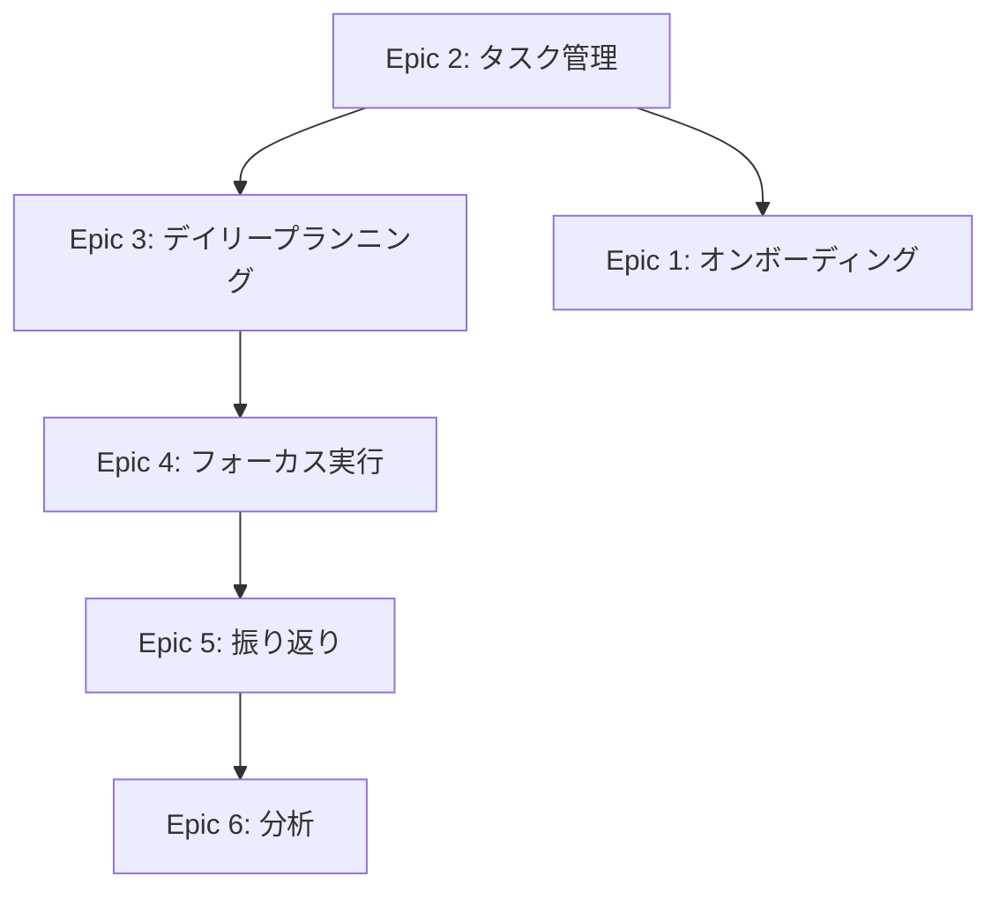

# Flowin MVP エピック一覧

このディレクトリには、Flowin デイリープランナーMVP開発のエピックが含まれています。

## エピック概要

| # | エピック名 | 優先度 | 推定工数 | 状態 |
|---|-----------|--------|---------|------|
| 1 | [ユーザーオンボーディング](./epic-1-user-onboarding.md) | Critical | 8日 | 📋 未着手 |
| 2 | [タスク管理基盤](./epic-2-task-management.md) | Critical | 11日 | 📋 未着手 |
| 3 | [デイリープランニング](./epic-3-daily-planning.md) | Critical | 12日 | 📋 未着手 |
| 4 | [フォーカス実行モード](./epic-4-focus-execution.md) | Critical | 12日 | 📋 未着手 |
| 5 | [デイリー振り返り](./epic-5-daily-reflection.md) | High | 10日 | 📋 未着手 |
| 6 | [分析とインサイト](./epic-6-analytics-insights.md) | Medium | 11日（Phase 1） | 📋 未着手 |

**合計推定工数**: 64日（Phase 1のみ）

## 実装順序

### Phase 1: コア機能（MVP必須）
1. **Epic 2: タスク管理基盤**（11日）
   - すべての機能の基盤となる
   - 最初に実装が必須

2. **Epic 1: ユーザーオンボーディング**（8日）
   - ユーザー獲得の入口
   - タスク管理基盤完成後に実装

3. **Epic 3: デイリープランニング**（12日）
   - コア体験の開始点
   - タスク管理基盤に依存

4. **Epic 4: フォーカス実行モード**（12日）
   - コア体験の中心
   - デイリープランニングに依存

5. **Epic 5: デイリー振り返り**（10日）
   - コア体験の完結
   - フォーカス実行モードに依存

### Phase 2: 拡張機能
6. **Epic 6: 分析とインサイト - Phase 1**（11日）
   - 基本的な週次サマリーと可視化
   - MVPに含めるか検討

### Phase 3: プレミアム機能（Post-MVP）
- Epic 6: Phase 2-3（高度な分析とAI）
- カレンダー統合（外部連携）
- チーム機能（将来拡張）

## エピック間の依存関係

## 成功指標マッピング

### ビジネスゴール達成への貢献

| ゴール | 貢献するエピック |
|--------|---------------|
| 月間アクティブユーザー1,000人 | Epic 1（オンボーディング） |
| DAU率30%以上 | Epic 3, 4, 5（コア体験） |
| 継続率60%（30日後） | Epic 5, 6（振り返りと成長） |
| セッション時間15分以上 | Epic 3, 4, 5（計画・実行・振り返り） |

### ユーザーゴール達成への貢献

| ゴール | 貢献するエピック |
|--------|---------------|
| 5分以内で計画 | Epic 3（デイリープランニング） |
| 集中力維持 | Epic 4（フォーカスモード） |
| リアルタイム進捗把握 | Epic 4（進捗トラッキング） |
| 簡単な振り返り | Epic 5（デイリー振り返り） |
| 継続的な成長実感 | Epic 6（分析とインサイト） |

## 各エピックの詳細

各エピックには以下の情報が含まれています：

- **概要**: エピックの目的と範囲
- **ビジネス価値**: なぜこれを作るのか
- **成功基準**: 何をもって成功とするか
- **ユーザーストーリー**: 具体的な機能要件
- **技術設計**: データモデル、API、UI設計
- **依存関係**: 前提となる機能
- **リスクと対策**: 想定される問題と解決策
- **実装優先度**: Critical/High/Medium/Low
- **推定工数**: 実装に必要な日数

## 開発開始前のチェックリスト

各エピック開始前に以下を確認：

- [ ] 依存するエピックが完了している
- [ ] 仕様書（PRD、デザインシステム、データモデル）を確認
- [ ] 技術スタックと依存ライブラリを確認
- [ ] テスト戦略を定義
- [ ] デザインモックアップを確認（必要に応じて）

## 関連ドキュメント

- [PRD（プロダクト要求仕様書）](../prd.md)
- [デザインシステム](../design-system.md)
- [データモデル](../data-model.md)
- [CLAUDE.md](../../CLAUDE.md) - 開発ガイドライン
- [AGENTS.md](../../AGENTS.md) - AIツール向けガイドライン
